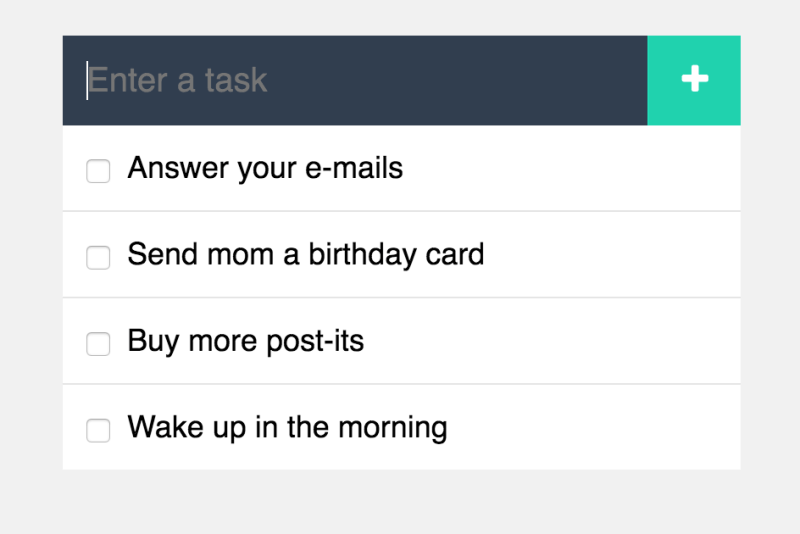

### 5. JAVASCRIPT TO-DO LIST



JavaScript is a wonderful tool for coding dynamic, interactive lists where users can add, edit, delete, and move items. It’s something you can’t achieve with just HTML and CSS.

If you are anything like me, you have a running list of seemingly never-ending to-dos:

-   Dealing with e-mails
-   Managing projects
-   Learning new things
-   Maintaining your portfolio
-   Knowing what groceries to buy
-   Places to visit on your next holiday
-   Movies to watch on Netflix

To make your life easier, you can build your own custom-coded to-do list as a JavaScript project right away. Start small and create a single list where you can simply add and delete items.


As your skills improve, you can add new features to help you manage your to-dos more efficiently.

- ```Bonus: ```
- For instance, you could use multiple lists next to each other to categorize your to-dos.
- ```Bonus: ```
- A particularly handy feature would be to enable a drag-and-drop feature for moving to-dos between the different lists and columns.